# Discovery Outcome koozie

<aside>
✅

This document shall serve as the Final Document as per the Discovery Outcome.

</aside>

## **Meeting Notes:**

---

[https://notes.granola.ai/p/3d4516cb-6752-4e92-b460-0713708651c7](https://notes.granola.ai/p/3d4516cb-6752-4e92-b460-0713708651c7)

---

## **Koozie AI Business Coaching Platform**

**Final Project Scope Document** 
**Version:** 3.0 (Final)

---

## Important Resources

Design: https://www.figma.com/proto/gvuCEED9UbsPBjamKccbfo/koozie-AI?page-id=1%3A2&node-id=4-2&node-type=canvas&viewport=1704%2C32%2C0.1&t=E7dYwc9i5zA1W6sD-1&scaling=min-zoom&content-scaling=fixed&starting-point-node-id=4%3A2&show-proto-sidebar=1

Wireframes: https://www.figma.com/proto/gvuCEED9UbsPBjamKccbfo/koozie-AI?page-id=2235%3A18461&node-id=2235-18545&node-type=frame&viewport=2028%2C482%2C0.11&t=ncDbpyAyagZUdh1J-1&scaling=min-zoom&content-scaling=fixed&starting-point-node-id=2235%3A18545

User Flow: 

```mermaid
graph TD
    %% Legend
    classDef prePrompt fill:#f9f,stroke:#333,stroke-width:2px;
    classDef guided fill:#bbf,stroke:#333,stroke-width:2px;
    classDef response fill:#bfb,stroke:#333,stroke-width:2px;
    classDef download fill:#ff9,stroke:#333,stroke-width:2px;
    classDef video fill:#9ff,stroke:#333,stroke-width:2px;
    classDef noteToAI fill:#f99,stroke:#333,stroke-width:2px;
    
    %% Start of flow
    A("Pre Prompt: This is my first time here"):::prePrompt --> B("Pre Prompt: Welcome to your online business coach, I am here to guide you through your business. Just before we get started I can work even quicker if you answer 5 questions before we get started:"):::prePrompt
    
    B --> C{Do you want to answer 5 questions?}:::guided
    C -->|Yes| D("Question 1: What industry does your business operate in?"):::guided
    C -->|No| E("Pre Prompt: What would you like me to help with today?"):::prePrompt
    
    D --> F("Question 2: How many employees do you have?"):::guided
    F --> G{Select number of employees}:::guided
    G -->|"It's just me"| H("Question 3: What is your annual turnover?"):::guided
    G -->|"2 to 10 people"| H
    G -->|"11 to 25 people"| H
    G -->|"26 to 50 people"| H
    G -->|"Over 51 people"| H
    
    H --> I{Select turnover}:::guided
    I -->|"Up to £100k"| J("Question 4: Which of these 6 areas interests you the most?"):::guided
    I -->|"£101K to £250K"| J
    I -->|"£251k to £500K"| J
    I -->|"£501K to £1million"| J
    I -->|"£1 Million to £5 Million"| J
    I -->|"£5 million plus"| J
    
    J --> K("Question 5: What is your no1 ambition for your business?"):::guided
    K --> L("Free text box: ..."):::response
    L --> M("Watch video on becoming a business owner"):::video
    L --> N("Download pack to start your business"):::download
    
    E --> O{Are you a member?}:::guided
    O -->|Yes| P("Good morning, [Use their name]\nHow can I help today?"):::prePrompt
    O -->|No| Q("Welcome to your AI coach. It's great to meet you. Just before we get started can I grab some information, just so I can best support you today. I learn very fast :-)"):::prePrompt
    
    P --> R("I can see we worked on: [add element from last time]"):::prePrompt
    R --> S{Continue or Start New?}:::guided
    S -->|"Pick up where we left off"| T("Prompt: How can I help you today?"):::prePrompt
    S -->|"I'd rather get straight into it"| T
    
    Q --> T
    
    %% User's Request Flow
    T --> U{User's Request}:::guided
    U -->|"Get me more leads"| V("Ask clarifying questions"):::guided
    V --> W("What industry do you operate in?"):::guided
    V --> X("How many leads do you currently get in per month?"):::guided
    V --> Y("Are you using any lead generating systems?"):::guided
    V --> Z("How many leads would you like to be generating each month?"):::guided
    V --> AA("How big is your business?\n<£100K | £101K to £250K | £251K to £500K | £501K to £1M | £1.1M+ "):::guided
    
    U -->|"I have a specific question about my business"| AB("Ask clarifying questions"):::guided
    U -->|"Give me inspiration on my business"| AC("Watch 2 min scale your business video"):::video
    AC --> AD("Video guides user through 4 areas of business - marketing, sales, operations & finance"):::video
    AD --> AE("What is your business?"):::guided
    AE --> AF("How big?"):::guided
    AF --> AG("Help me with my plan"):::response

    AG --> AH("Prompt: Marketing focus"):::prePrompt
    AH --> AI("How many people?"):::guided
    AI --> AJ("Take user through business planning"):::guided
    AJ --> AK("Suggest marketing process ideas"):::guided
    AK --> AL("Here at Grow we use our grow formula for our business planning process"):::guided
    AL --> AM("Present suggested answer"):::response
    AM --> AN("Follow coaching process"):::noteToAI

    %% Coaching Process Stages
    AN --> AO("Stage 1: Clarify 5 to 7 year objectives"):::guided
    AO --> AP("Add a B-Hag [Big Hairy Audacious Goal]"):::noteToAI
    AP --> AQ("Use the Venn diagram and turn that into a pack for download"):::noteToAI
    AQ --> AR("Have you heard of creating strategic partners?"):::guided
    AR --> AS("We guide clients through building strategic partners to generate leads"):::guided
    AS --> AT("Provide template link for planning [Click to download]"):::download

    AT --> AU("Stage 2: Discover what the business needs to achieve"):::guided
    AU --> AV("Discuss strategies and larger elements for momentum"):::guided
    AV --> AW("Plot on provided template"):::guided
    AW --> AX("Provide analogy for planning journey"):::guided
    AX --> AY("Download strategic partners guide here"):::download
    AY --> AZ("Provide 90-day planning template [Click to download]"):::download
    AZ --> BA("Add picture of recent plan completion"):::noteToAI
    BA --> BB("Add strategic partnership video course [Click here]"):::video

    BB --> BC("Stage 3: Final stages of planning and details"):::guided
    BC --> BD("Identify annual objectives and next quarter goals"):::guided
    BD --> BE("Discuss tasks to be completed with timelines"):::guided
    BE --> BF("Apply to template for clear view of needed actions"):::guided
    BF --> BG("Prompt: Are you looking to add more people to your business?"):::guided
    BG --> BH("Prompt: Do you need business funding?"):::guided
    BH --> BI("Prompt: Do you need more customers?"):::guided

    BI --> BJ("Introduce strategic partners concept again"):::guided
    BJ --> BK("Download strategic partners guide here"):::download
    BK --> BL("Add strategic partnership video course [Click here]"):::video

    %% Planning Options
    BL --> BM("Prompt: Do you have a plan?"):::guided
    BM --> BN{User has a plan?}:::guided
    BN -->|"I don't have a plan"| BO("Suggest exercises for personal and business planning"):::guided
    BO --> BP("Offer 5-year planning session"):::guided
    
    BN -->|"Yes, I have a plan"| BQ("Make suggestions to enhance their plan"):::guided
    BQ --> BR("Consideration: Size of business - £100k, £500k, £1 million+"):::guided
    BR --> BS("Provide 2-minute video introductions based on size"):::video
    BS --> BT("Video: 5-year business plan"):::video
    BT --> BU("Download long-term business goals"):::download
    BU --> BV("Video: 1-year business plan"):::video
    BV --> BW("Download 1-year business goals"):::download
    BW --> BX("Video: 90-day business plan"):::video
    BX --> BY("Download 90-day business planner"):::download

    %% End of Flow
    BY --> BZ("Thank user and offer further assistance"):::prePrompt

```

## **Table of Contents**

1. [Introduction](Discovery%20Outcome%20koozie%2014b9ae7944c6803893b4e85c52005098.md)
2. [Key Features and Functionalities](Discovery%20Outcome%20koozie%2014b9ae7944c6803893b4e85c52005098.md)
3. [User Journey](Discovery%20Outcome%20koozie%2014b9ae7944c6803893b4e85c52005098.md)
4. [AI Model and Knowledge Base](Discovery%20Outcome%20koozie%2014b9ae7944c6803893b4e85c52005098.md)
5. [Admin Panel](Discovery%20Outcome%20koozie%2014b9ae7944c6803893b4e85c52005098.md)
6. [Subscription Tiers](Discovery%20Outcome%20koozie%2014b9ae7944c6803893b4e85c52005098.md)
7. [Technology Stack](Discovery%20Outcome%20koozie%2014b9ae7944c6803893b4e85c52005098.md)
8. [Branding and Mascot](Discovery%20Outcome%20koozie%2014b9ae7944c6803893b4e85c52005098.md)
9. [Timeline and Next Steps](Discovery%20Outcome%20koozie%2014b9ae7944c6803893b4e85c52005098.md)
10. [Changes from Previous Version (V2)](Discovery%20Outcome%20koozie%2014b9ae7944c6803893b4e85c52005098.md)

---

## **1. Introduction**

This document defines the final scope for the Koozie AI Business Coaching Platform (V3), incorporating all revisions and feedback. It serves as the definitive guide for development and will be used for project sign-off.

## **2. Key Features and Functionalities**

- **Personalized Onboarding:** Users provide their industry and can optionally answer five quick-start questions to personalize their experience.
- **AI-Driven Coaching:** Two core functionalities, General Business Advice, and Goal-Oriented Coaching, are integrated into a single AI coach powered by GPT-4.
- **Immutable Goal Setting:** Users set goals with deadlines that cannot be changed once confirmed, fostering commitment and focus.
- **Task Breakdown Assistance:** The AI helps break down large goals into smaller, manageable tasks.
- **Rich Resource Library:** Access to curated videos, templates, guides, and other resources.
- **'Consult koozie' Feature:** Goal-specific assistance and advice from the AI coach.
- **Progress Tracking and Visualization:** The dashboard displays progress, upcoming deadlines, and key insights.
- **Customizable Notifications:** Users choose notification preferences during sign-up (email, in-app, WhatsApp).
- **Admin Panel:** Administrators can manage content, monitor interactions, and update the AI knowledge base.
- **Subscription Tiers:** Different tiers will offer varying levels of access, features, and support.
- **"Talk to a Human" Option:** Available for premium subscribers to connect with a human coach.

## **3. User Journey**

**3.1 Initial Access & Authentication**

1. **Access Website:** The user navigates to [app.koozie.ai](http://app.koozie.ai/).
2. **Sign-Up/Login:**
    - **Google Sign-In:** Streamlined authentication using a Google account.
    - **Email/Password:** Create an account with email and password, followed by verification.
3. **Onboarding License Agreement:** The user reads and accepts the terms of service and privacy policy.
4. **Industry Selection:** The user selects their industry (required).
5. **Welcome Message:** The AI coach greets the user with a personalized welcome.

**3.2 Onboarding and Goal Exploration**

1. **Optional Five Questions:**
    - Users can answer five quick-start questions to personalize the experience further (optional).
    - Skipping this step leads directly to the Strategic Partner Prompt.
2. **Immediate Guidance** 
- Based on answers and basic information that the user provides, the AI coach will guide them.
1. **Follow up questions**
- Based on answers and basic information that the user provides, the AI coach will guide them.
1. **Immediate Resource Provision**
    - Based on answers (or industry if skipped), the AI provides personalized resources (videos, guides).zx
2. **Strategic Partner Prompt:**
    - The AI encourages users to consider strategic partnerships for growth.
    - Offers resources and guidance on finding and managing partners.
    - Book recommendations. (affiliate marketing)
    1. **Further assistance**
    - After 20 interactions, a specific video from Phil or Paul creates a more personalized experience and reminds them of the platform’s capabilities.

**3.3 Goal Setting & Coaching**

1. **Goal Setting Process:**
    - The AI guides the user through setting SMART goals within a 90-day timeframe.
    - Users define goal titles, key points/milestones, and immutable deadlines.
    - The AI emphasizes the commitment to deadlines and offers support in task breakdown.
2. **Dashboard Overview:** The user is presented with their personalized dashboard, displaying goals, progress, resources, notifications, and more.

**3.4 Ongoing Interaction**

1. **Consult koozie AI:** Users can seek assistance, advice, and resources from the AI coach related to their goals, their business, or general business inquiries.
2. **Progress Tracking:** Users update their goal progress, and the platform provides visual feedback.
3. **Resource Access:** Users explore recommended videos, guides, and other materials (Video upload would be only via video hosting platforms such as YouTube or Vimeo).
4. **Notifications:** Email, in-app, or optional WhatsApp reminders keep users informed.
5. **Notifications Frequency:** Users can opt-in, and can set accountability levels: 1) Once a day 
6. **Exiting the Platform:** Users can end the session and securely log out, with their progress saved automatically.

## **4. AI Model and Knowledge Base**

- **GPT-4 with RAG:** Koozie leverages the advanced GPT-4 language model with a Retrieval Augmented Generation (RAG) approach to provide accurate, relevant, and contextualized coaching responses.
- **Extensive Knowledge Base:** The AI knowledge base is populated with diverse materials:
    - **Initial Seed Data:** 50 comprehensive examples provided by Phil covering various business scenarios and coaching strategies.
    - **Company's Existing eBooks:** Content will be integrated into the knowledge base.
    - **Curated Resources:** Relevant and updated information from trusted external sources.
    - **Post Session Survey**
        - Thumbs up or thumbs down only (in the beginning)
        - Quantitative analysis of user sentiment on the admin panel based on the above.
        - Prompt system to reach out to users who have been inactive for 10 days (for 3 months)

## **5. Admin Panel**

- **Content Management:** Admins can upload and manage resources, ensuring content is concise, relevant, and free of confusing examples or sensitive information.
- **Knowledge Base Updates:** Admins are responsible for adding new material and updating existing content in the knowledge base.
- **AI Monitoring:** Admins can monitor AI interactions, user feedback, and platform performance.

## **6. Subscription Tiers**

**7.1 Free Tier:**

- Basic AI coaching with limited interactions.
- Access to a limited number of resources.
- Basic progress tracking.
- Email notifications only.

**7.2 Premium Tier:**

- Unlimited AI coaching interactions.
- Full access to all resources.
- Advanced progress tracking and visualization.
- All notification options (email, in-app, SMS/WhatsApp).
- "Talk to a human" option for personalized consultations with expert coaches.

**Note:** Specific pricing and feature details for each tier will be finalized during the design phase.

<aside>
ℹ️

## **7. Technology Stack**

- Frontend: [Bubble.io](http://Bubble.io) (Low code solution)
- Backend: Python & Bubble.io
- Database: MongoDB or Bubble DB
- AI Model: GPT-4
- Cloud Infrastructure: Bubble.io
</aside>

## **8. Branding and Mascot**

- The platform's name will be "koozie" (lowercase).
- A friendly and approachable robot mascot will be created to enhance brand identity and user experience.
- Renesis will handle branding design, including the logo, color scheme, and overall visual style.
- Design tools: Figma

### **Final User Flow: Koozie AI Business Coaching Platform**

### **1. Accessing the Platform**

1. **Entry Point:**
    - User visit [app.koozie.ai](http://app.koozie.ai/) on their browser.
2. **Authentication Options:**
    - **Google Sign-In:** The user clicks the Google Sign-In button for streamlined access.
    - **Email/Password Registration:**
        - The user enters their email and creates a password.
        - The verification email is sent; the user confirms the account to proceed.
3. **License Agreement:**
    - The user reviews and accepts the **Terms of Service** and **Privacy Policy** to continue.

---

### **2. Onboarding & Personalization**

1. **Industry Selection:**
    - User selects their primary industry from a dropdown menu (mandatory).
    - Information is stored for future coaching customization.
2. **Optional Personalization Questions:**
    - The user is presented with **5 quick-start questions**:
        - Example questions: "What is your main business challenge right now?" or "What are your revenue goals for the next quarter?"
    - Option to skip these questions.
3. **Immediate Guidance:**
    - Based on the user’s answers or industry selection (if skipped), the AI coach:
        - Offers tailored business insights.
        - Recommends initial resources (e.g., videos, guides).
    - Personalized welcome message:
        - "Welcome, [User Name]! Based on your industry and goals, here are some initial tips to get started."
4. **Strategic Partner Prompt:**
    - The AI encourages strategic partnerships for growth.
    - Offers:
        - A resource list.
        - Affiliate book recommendations.
5. **Interactive Video Personalization (Post 20 Interactions):**
    - The user receives a special personalized video (e.g., from Phil or Paul), introducing additional platform features.

---

### **3. Setting Goals**

1. **SMART Goal Setting:**
    - AI prompts the user to set a **90-day goal** with the following parameters:
        - **Goal Title** (e.g., "Increase monthly sales by 20%.")
        - **Key Milestones** (e.g., "Hire a sales rep, develop sales scripts, train staff.")
        - **Deadline** (immutable once confirmed).

<aside>
ℹ️

Note: When users access the goals module for the first time, they should have a tutorial video explaining how the goals feature works. After the user sets their goal, a summary of their goals and follow-up instructions will be sent to their email.

</aside>

1. **Task Breakdown Assistance:**
    - AI helps break large goals into smaller, actionable tasks which the user can request the bot once it generates the plan.
    - Example output:
        - Task 1: Identify top sales roles needed (by Week 1).
        - Task 2: Post job listings (by Week 2).
        - Task 3: Conduct interviews (by Week 3).
2. **Commitment Confirmation:**
    - The user reviews the goal and confirms. AI reinforces the importance of commitment and deadlines.
3. **Dashboard Introduction:**
    - User is guided to their **Dashboard**, featuring:
        - Progress tracking.
        - Current tasks.
        - Suggested resources.
        - Notifications and insights.

---

### **4. Ongoing Interactions**

1. **Consult Koozie AI:**
    - The user interacts with the AI for:
        - Goal-specific advice.
        - General business coaching.
        - Problem-solving assistance.
        - Suggested resources (curated guides, templates, and videos).

The user can start typing their prompts and upload documents (.PDF or .docx) related to their business as well if needed.

1. **Progress Updates:**
    - The user logs progress on tasks or milestones.
    - AI encourages and suggests adjustments if the user is behind schedule.
2. **Resource Access:**
    - The user explores recommended resources:
        - E-books, templates, case studies, or video tutorials.
3. **Strategic Notifications:**
    - Based on user-defined preferences:
        - **Email, In-App, or WhatsApp Alerts** (Verified Meta App will be provided by the client)**.**
        - Frequency: Once per day, weekly, or only for deadlines.
    - Notifications include:
        - Task reminders.
        - Progress milestones.
        - Encouragement messages.
4. **Gamification Engagement:**
    - User earns points and badges for:
        - Setting goals.
        - Completing tasks.
        - Logging progress.

---

### **5. Enhancing Experience**

1. **Post-Session Feedback:**
    - After key interactions, users rate the AI with a **thumbs up** or **thumbs down**.
    - Admins collect feedback for platform improvement.
2. **Reactivation Prompts:**
    - Users inactive for 10 days receive a notification:
        - “Hi [User Name], let’s get back on track with your goals! Click here to continue.”
3. **Premium Human Support:**
    - Premium users access the **“Talk to a Human”** feature:
        - Schedule one-on-one sessions with a human coach.

---

### **6. Exiting the Platform**

1. **Logout Process:**
    - The user clicks the logout button, securely ending the session.
    - AI ensures all progress is saved automatically.

---

### **Admin Flow Integration**

While users interact with the platform, **admins** operate in the background:

- Monitor user engagement and feedback.
- Update AI knowledge base with new content.
- Review user feedback metrics and sentiment for continuous improvement.

## **9. Timeline and Next Steps (2.5 - 3 months)**

- **Design Phase: (2 weeks)**
    - Develop detailed wireframes, UI mockups, and design prototypes.
    - Finalize branding and mascot design.
    - Define detailed specifications for all features.
- **AI & Web Development Phase: (10 weeks)**
    - Build the frontend and backend infrastructure.
    - Implement AI functionalities and integrate with GPT-4 and the RAG system.
    - Develop the admin panel and content management system.
    - Implement security measures and ensure data privacy compliance.
- **Testing and Refinement: (1 week)**
    - Conduct thorough testing of all functionalities.
    - Gather feedback from internal testers and make necessary adjustments.
- **Launch and Early Access Program: (1 week)**
    - Launch the MVP (Minimum Viable Product) with core features.
    - Offer early access to initial subscribers and gather feedback.
- **Ongoing Maintenance and Updates: (1-month free maintenance)**
    - Minor improvements, content updates, prompts betterment, and user feedback incorporation (Bugs or minor updates)

## Resources Needed

<aside>
❗

To ensure smooth progress for the Koozie AI development, we kindly request the following resources to be provided:

1. **Bubble.io Account**
    - Plan: Starter Plan ($32/month, sufficient for our needs)
    - **Benefits:**
        - Covers project deployment and database management.
2. **OpenAI Account**
    - Add a payment method to enable API key usage for AI functionalities.
3. **Google Account**
    - Required for Social Authentication integration.
4. **SMTP Service**
    - Options: MailTrap or MailJet (Free Tier will suffice for development purposes).
    - Purpose: For email-sending functionality.

Providing these resources will help us align with the project timeline and ensure seamless development. Please let us know once these are set up or if you require any assistance.

</aside>

---

## **Next Steps:**

- **Stakeholder Review:** Please review this final document carefully.
- **Sign-Off:** If the document is deemed complete and accurate, please provide your sign-off to indicate approval and authorization to proceed with development.