# Koozie AI previously GrowAI

Summary: The document outlines the flow and structure of an AI Business Coach application, detailing user interactions through a series of guided questions and responses. It includes various stages such as user prompts, decision points, and options for users to explore their business needs, ambitions, and planning processes. The application aims to assist users in identifying their business industry, employee count, annual turnover, and specific interests, while also providing resources like videos and downloadable content for further support.
Title: Grow Partner AI Chatbot
Collaborator: Hamza
Cover: https://www.growpartnership.co.uk/wp-content/uploads/2024/05/grow-partnership-logo.webp
Is Active: Yes
Status: Done
Website: https://www.growpartnership.co.uk/

<aside>
🚨

## Discovery Documents:

**The latest up-to-date Document (Dec 4, 2024)**

[Discovery Outcome koozie](Discovery%20Outcome%20koozie%2014b9ae7944c6803893b4e85c52005098.md)

Previous versions are to be added in the Sign off document as the document was created based off the information that PMO’s have been having with the client for versioning and record basis

- V1 [Final Flow and Discovery Outcome V1 (Outdated)](Final%20Flow%20and%20Discovery%20Outcome%20V1%20(Outdated)%2013e9ae7944c680fb8428e953dba2d984.md)
- V2 [Updated User Journey v2 (Outdated)](Updated%20User%20Journey%20v2%20(Outdated)%201459ae7944c68039ae8aebdc3eddfc85.md)

## Other Sources

[Final Flow and Discovery Outcome V1 (Outdated)](Final%20Flow%20and%20Discovery%20Outcome%20V1%20(Outdated)%2013e9ae7944c680fb8428e953dba2d984.md)

[**Main Coaching Interaction**](Main%20Coaching%20Interaction%201439ae7944c6808eb8cbf7166b988c65.md)

[(Click Here) Clarity on Key Questions from Client   (Click Here)]((Click%20Here)%20Clarity%20on%20Key%20Questions%20from%20Client%20%201389ae7944c68036af2ee89372b0e473.md)

<aside>
🔧

<aside>
🚨

## For AI Resource and Suggestion

We are currently considering two approaches for implementing the AI functionalities in Koozie (General Business Advice and Goal-Oriented Coaching):

1. **Single Bot with Modular Design:** Both functionalities would reside within a single AI bot, but the code would be structured in separate modules for potential future separation.
2. **Two Distinct Bots:** Each functionality would be handled by a separate AI bot from the outset.

As per my experience I would recommend the **two-bot approach** for better long-term scalability, maintainability, and potential for specialized AI models/training. However, I do acknowledge the single-bot approach might be simpler for initial development.

Could you please assess both approaches and recommend the most suitable architecture for Koozie? Your assessment should consider the following factors:

- **Scalability and Performance:** How well can each approach handle future growth in user base and data volume?
- **Maintainability:** How easily can each approach be updated, debugged, and extended with new features?
- **Flexibility:** How readily can each approach adapt to changes in AI technology, model upgrades, or integrations?
- **Resource Utilization:** What are the resource implications (e.g., computational resources, cost) of each approach?
</aside>

The document was also Created here please see for reference: 
[AI Related Specifics](AI%20Related%20Specifics%201459ae7944c6800e8b7ae28d9b79b035.md) 

</aside>

</aside>

@Aalia please see the Documents attached in the above box 👆🏻

[**Business Requirements Document (BRD) for AI Business Coach Application**](Business%20Requirements%20Document%20(BRD)%20for%20AI%20Busine%201349ae7944c6805ab105de48d2a9e1fb.md)

@Muqadas 

@Ali Raza 

@Hamza 

Wireframes: https://app.visily.ai/projects/8058bd30-5b95-4d80-91e3-edfb11cc94cf/boards/1414579 @Aalia 

### Please see the Flow of the Application here:

```mermaid
graph TD
    %% Legend
    classDef prePrompt fill:#f9f,stroke:#333,stroke-width:2px;
    classDef guided fill:#bbf,stroke:#333,stroke-width:2px;
    classDef response fill:#bfb,stroke:#333,stroke-width:2px;
    classDef download fill:#ff9,stroke:#333,stroke-width:2px;
    classDef video fill:#9ff,stroke:#333,stroke-width:2px;
    classDef noteToAI fill:#f99,stroke:#333,stroke-width:2px;
    
    %% Start of flow
    A("Pre Prompt: This is my first time here"):::prePrompt --> B("Pre Prompt: Welcome to your online business coach, I am here to guide you through your business. Just before we get started I can work even quicker if you answer 5 questions before we get started:"):::prePrompt
    
    B --> C{Do you want to answer 5 questions?}:::guided
    C -->|Yes| D("Question 1: What industry does your business operate in?"):::guided
    C -->|No| E("Pre Prompt: What would you like me to help with today?"):::prePrompt
    
    D --> F("Question 2: How many employees do you have?"):::guided
    F --> G{Select number of employees}:::guided
    G -->|"It's just me"| H("Question 3: What is your annual turnover?"):::guided
    G -->|"2 to 10 people"| H
    G -->|"11 to 25 people"| H
    G -->|"26 to 50 people"| H
    G -->|"Over 51 people"| H
    
    H --> I{Select turnover}:::guided
    I -->|"Up to £100k"| J("Question 4: Which of these 6 areas interests you the most?"):::guided
    I -->|"£101K to £250K"| J
    I -->|"£251k to £500K"| J
    I -->|"£501K to £1million"| J
    I -->|"£1 Million to £5 Million"| J
    I -->|"£5 million plus"| J
    
    J --> K("Question 5: What is your no1 ambition for your business?"):::guided
    K --> L("Free text box: ..."):::response
    L --> M("Watch video on becoming a business owner"):::video
    L --> N("Download pack to start your business"):::download
    
    E --> O{Are you a member?}:::guided
    O -->|Yes| P("Good morning, [Use their name]\nHow can I help today?"):::prePrompt
    O -->|No| Q("Welcome to your AI coach. It's great to meet you. Just before we get started can I grab some information, just so I can best support you today. I learn very fast :-)"):::prePrompt
    
    P --> R("I can see we worked on: [add element from last time]"):::prePrompt
    R --> S{Continue or Start New?}:::guided
    S -->|"Pick up where we left off"| T("Prompt: How can I help you today?"):::prePrompt
    S -->|"I'd rather get straight into it"| T
    
    Q --> T
    
    %% User's Request Flow
    T --> U{User's Request}:::guided
    U -->|"Get me more leads"| V("Ask clarifying questions"):::guided
    V --> W("What industry do you operate in?"):::guided
    V --> X("How many leads do you currently get in per month?"):::guided
    V --> Y("Are you using any lead generating systems?"):::guided
    V --> Z("How many leads would you like to be generating each month?"):::guided
    V --> AA("How big is your business?\n<£100K | £101K to £250K | £251K to £500K | £501K to £1M | £1.1M+ "):::guided
    
    U -->|"I have a specific question about my business"| AB("Ask clarifying questions"):::guided
    U -->|"Give me inspiration on my business"| AC("Watch 2 min scale your business video"):::video
    AC --> AD("Video guides user through 4 areas of business - marketing, sales, operations & finance"):::video
    AD --> AE("What is your business?"):::guided
    AE --> AF("How big?"):::guided
    AF --> AG("Help me with my plan"):::response

    AG --> AH("Prompt: Marketing focus"):::prePrompt
    AH --> AI("How many people?"):::guided
    AI --> AJ("Take user through business planning"):::guided
    AJ --> AK("Suggest marketing process ideas"):::guided
    AK --> AL("Here at Grow we use our grow formula for our business planning process"):::guided
    AL --> AM("Present suggested answer"):::response
    AM --> AN("Follow coaching process"):::noteToAI

    %% Coaching Process Stages
    AN --> AO("Stage 1: Clarify 5 to 7 year objectives"):::guided
    AO --> AP("Add a B-Hag [Big Hairy Audacious Goal]"):::noteToAI
    AP --> AQ("Use the Venn diagram and turn that into a pack for download"):::noteToAI
    AQ --> AR("Have you heard of creating strategic partners?"):::guided
    AR --> AS("We guide clients through building strategic partners to generate leads"):::guided
    AS --> AT("Provide template link for planning [Click to download]"):::download

    AT --> AU("Stage 2: Discover what the business needs to achieve"):::guided
    AU --> AV("Discuss strategies and larger elements for momentum"):::guided
    AV --> AW("Plot on provided template"):::guided
    AW --> AX("Provide analogy for planning journey"):::guided
    AX --> AY("Download strategic partners guide here"):::download
    AY --> AZ("Provide 90-day planning template [Click to download]"):::download
    AZ --> BA("Add picture of recent plan completion"):::noteToAI
    BA --> BB("Add strategic partnership video course [Click here]"):::video

    BB --> BC("Stage 3: Final stages of planning and details"):::guided
    BC --> BD("Identify annual objectives and next quarter goals"):::guided
    BD --> BE("Discuss tasks to be completed with timelines"):::guided
    BE --> BF("Apply to template for clear view of needed actions"):::guided
    BF --> BG("Prompt: Are you looking to add more people to your business?"):::guided
    BG --> BH("Prompt: Do you need business funding?"):::guided
    BH --> BI("Prompt: Do you need more customers?"):::guided

    BI --> BJ("Introduce strategic partners concept again"):::guided
    BJ --> BK("Download strategic partners guide here"):::download
    BK --> BL("Add strategic partnership video course [Click here]"):::video

    %% Planning Options
    BL --> BM("Prompt: Do you have a plan?"):::guided
    BM --> BN{User has a plan?}:::guided
    BN -->|"I don't have a plan"| BO("Suggest exercises for personal and business planning"):::guided
    BO --> BP("Offer 5-year planning session"):::guided
    
    BN -->|"Yes, I have a plan"| BQ("Make suggestions to enhance their plan"):::guided
    BQ --> BR("Consideration: Size of business - £100k, £500k, £1 million+"):::guided
    BR --> BS("Provide 2-minute video introductions based on size"):::video
    BS --> BT("Video: 5-year business plan"):::video
    BT --> BU("Download long-term business goals"):::download
    BU --> BV("Video: 1-year business plan"):::video
    BV --> BW("Download 1-year business goals"):::download
    BW --> BX("Video: 90-day business plan"):::video
    BX --> BY("Download 90-day business planner"):::download

    %% End of Flow
    BY --> BZ("Thank user and offer further assistance"):::prePrompt

```



- **Pre Prompt**: Initial messages to the user.
- **Guided**: Questions guiding the user through the flow.
- **Response**: User inputs or selections.
- **Download Link**: Nodes providing downloadable content.
- **Video**: Nodes linking to videos.
- **Note to AI**: Internal notes or actions for the AI to consider.

---

### **1. Start Node**

- **Type**: Start
- **Name**: **`Start`**
- **Description**: Entry point of the flow.

---

### **2. Pre Prompt: First Time Here**

- **Type**: Message
- **Name**: **`Pre Prompt - First Time Here`**
- **Content**: "This is my first time here."

---

### **3. Pre Prompt: Welcome Message**

- **Type**: Message
- **Name**: **`Pre Prompt - Welcome Message`**
- **Content**:
    
    WrappedCopy Code
    
    ```
    Welcome to your online business coach, I am here to guide you through your business. Just before we get started, I can work even quicker if you answer 5 questions before we get started:
    
    ```
    

---

### **4. Decision: Answer 5 Questions**

- **Type**: Choice
- **Name**: **`Decision - Answer 5 Questions`**
- **Prompt**: "Would you like to answer 5 questions?"
- **Options**:
    - Yes
    - No

---

### **5. Question 1: Business Industry**

- **Type**: Input
- **Name**: **`Question 1 - Business Industry`**
- **Prompt**: "What industry does your business operate in?"

---

### **6. Question 2: Number of Employees**

- **Type**: Choice
- **Name**: **`Question 2 - Number of Employees`**
- **Prompt**: "How many employees do you have?"
- **Options**:
    - It's just me
    - 2 to 10 people
    - 11 to 25 people
    - 26 to 50 people
    - Over 51 people

---

### **7. Question 3: Annual Turnover**

- **Type**: Choice
- **Name**: **`Question 3 - Annual Turnover`**
- **Prompt**: "What is your annual turnover?"
- **Options**:
    - Up to £100k
    - £101K to £250K
    - £251k to £500K
    - £501K to £1million
    - £1 Million to £5 Million
    - £5 million plus

---

### **8. Question 4: Area of Interest**

- **Type**: Choice
- **Name**: **`Question 4 - Area of Interest`**
- **Prompt**: "Which of these 6 areas interests you the most?"
- **Options**:
    - Business planning
    - Marketing
    - Sales
    - Operations
    - Finance
    - Removing myself from the business

---

### **9. Question 5: No.1 Ambition**

- **Type**: Input
- **Name**: **`Question 5 - No1 Ambition`**
- **Prompt**: "What is your number one ambition for your business?"

---

### **10. Video: Becoming a Business Owner**

- **Type**: Media
- **Name**: **`Video - Becoming a Business Owner`**
- **Content**: Link to the video on becoming a business owner.

---

### **11. Download: Start Your Business Pack**

- **Type**: Download
- **Name**: **`Download - Start Your Business Pack`**
- **Content**: Link to download the business starter pack.

---

### **12. Pre Prompt: Assistance Inquiry**

- **Type**: Message
- **Name**: **`Pre Prompt - Assistance Inquiry`**
- **Content**: "What would you like me to help with today?"

---

### **13. Pre Prompt: No Business Yet**

- **Type**: Message
- **Name**: **`Pre Prompt - No Business Yet`**
- **Content**: "I don't have a business yet."

---

### **14. Decision: Membership Status**

- **Type**: Choice
- **Name**: **`Decision - Membership Status`**
- **Prompt**: "Are you a member?"
- **Options**:
    - Yes
    - No

---

### **15. Member Greeting**

- **Type**: Message
- **Name**: **`Member Greeting`**
- **Content**:
    
    WrappedCopy Code
    
    ```
    Good morning, [User's Name]. How can I help today?
    
    ```
    

---

### **16. Non-Member Welcome**

- **Type**: Message
- **Name**: **`Non-Member Welcome`**
- **Content**:
    
    WrappedCopy Code
    
    ```
    Welcome to your AI coach. It's great to meet you. Just before we get started, can I grab some information, just so I can best support you today? I learn very fast :-)
    
    ```
    

---

### **17. Member Previous Interaction**

- **Type**: Message
- **Name**: **`Member Previous Interaction`**
- **Content**:
    
    WrappedCopy Code
    
    ```
    I can see we worked on: [add element from last time]
    
    ```
    

---

### **18. Decision: Continue or Start New**

- **Type**: Choice
- **Name**: **`Decision - Continue or Start New`**
- **Prompt**: "Would you like to pick up where we left off or get straight into it?"
- **Options**:
    - Pick up where we left off
    - I'd rather get straight into it

---

### **19. Prompt: How Can I Help Today?**

- **Type**: Message
- **Name**: **`Prompt - How Can I Help Today`**
- **Content**: "How can I help you today?"

---

### **20. User Options**

- **Type**: Choice
- **Name**: **`User Options`**
- **Prompt**: "Please select an option:"
- **Options**:
    - Get me more leads
    - I have a specific question about my business
    - Give me inspiration on my business

---

### **21. Clarifying Questions for Leads**

- **Type**: Input Series
- **Name**: **`Clarifying Questions - Leads`**
- **Questions**:
    1. "What industry do you operate in?"
    2. "How many leads do you currently get per month?"
    3. "Are you using any lead generating systems?"
    4. "How many leads would you like to be generating each month?"
    5. "How big is your business?" (Options: <£100K | £101K to £250K | £251K to £500K | £501K to £1M | £1.1M+)

---

### **22. Video: Scale Your Business**

- **Type**: Media
- **Name**: **`Video - Scale Your Business`**
- **Content**: Link to the 2-minute scale your business video.

---

### **23. Business Details Inquiry**

- **Type**: Input Series
- **Name**: **`Business Details Inquiry`**
- **Questions**:
    1. "What is your business?"
    2. "How big is your business?"
    3. "How many people are in your team?"

---

### **24. Assist with Plan**

- **Type**: Message
- **Name**: **`Assist with Plan`**
- **Content**: "Help me with my plan."

---

### **25. Focus Area Prompt**

- **Type**: Choice
- **Name**: **`Focus Area Prompt`**
- **Prompt**: "Which area would you like to focus on?"
- **Options**:
    - Marketing
    - Sales
    - Operations
    - Finance

---

### **26. Coaching Process Stages**

- **Type**: Message Series
- **Name**: **`Coaching Process Stages`**
- **Stages**:
    - **Stage 1**: Clarify 5 to 7-year objectives.
    - **Stage 2**: Determine business needs to achieve personal goals.
    - **Stage 3**: Identify annual objectives and tasks for the next quarter.

---

### **27. Downloads and Resources**

- **Type**: Download Links and Media
- **Name**: **`Downloads and Resources`**
- **Content**:
    - Template links for planning.
    - Strategic partners guide.
    - 90-day planning template.
    - Video courses.

---

### **28. Prompt: Additional Support**

- **Type**: Choice
- **Name**: **`Prompt - Additional Support`**
- **Prompt**:
    
    WrappedCopy Code
    
    ```
    Are you looking to:
    - Add more people to your business?
    - Need business funding?
    - Get more customers?
    
    ```
    
- **Options**:
    - Add more people
    - Need funding
    - Get more customers

---

### **29. Plan Inquiry**

- **Type**: Choice
- **Name**: **`Plan Inquiry`**
- **Prompt**: "Do you have a plan?"
- **Options**:
    - I don't have a plan
    - Yes, I have a plan

---

### **30. Offer Planning Session**

- **Type**: Message
- **Name**: **`Offer Planning Session`**
- **Content**: Suggest exercises for personal and business planning and offer a 5-year planning session.

---

### **31. Suggestions for Existing Plan**

- **Type**: Message
- **Name**: **`Suggestions for Existing Plan`**
- **Content**: Provide suggestions to enhance their existing plan based on business size.

---

### **32. Video Introductions**

- **Type**: Media
- **Name**: **`Video Introductions`**
- **Content**:
    - 2-minute video introductions based on business size (£100k, £500k, £1 million+).

---

### **33. Download Business Goals**

- **Type**: Download Links
- **Name**: **`Download Business Goals`**
- **Content**:
    - Long-term business goals
    - 1-year business goals
    - 90-day business planner

---

### **34. Planning Introduction**

- **Type**: Message
- **Name**: **`Planning Introduction`**
- **Content**: Introduction to planning phases (Long Term, Short Term, Instant Impact [90 Day]).

---

### **35. End Node**

- **Type**: Message
- **Name**: **`End Message`**
- **Content**: "Thank you for using our AI coach. Let me know if there's anything else I can assist you with!"

<aside>


Please see the Files Attached below:  

[business_coach_app.py](business_coach_app.py)

[business.py](business.py)

[Company.py](Company.py)

</aside>

To `Run` please use the **Command** `streamlit run {filename}` 

**pre-requisites:** 

`streamlit`

`numpy`

`pandas`

[Discovery Outcome v3  (Final)](Discovery%20Outcome%20v3%20(Final)%201499ae7944c6809b8f02fd176ae537b7.md)

[Updated User Journey v2 (Outdated)](Updated%20User%20Journey%20v2%20(Outdated)%201459ae7944c68039ae8aebdc3eddfc85.md)