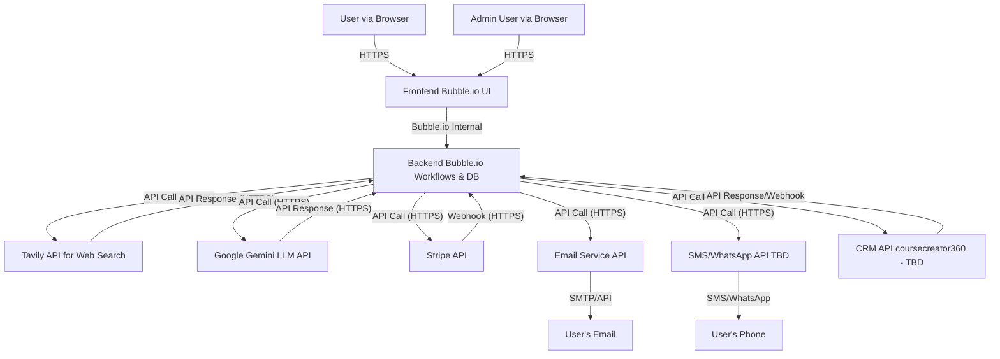

# Technical Architecture Document: Koozie AI

## 1. Introduction

### 1.1 Purpose
This document describes the technical architecture of the Koozie AI platform. It outlines the major components, their interactions, technologies used, data storage, and integration with external services, including the AI model.

### 1.2 Scope
The scope of this document covers the high-level architecture of Koozie AI, focusing on the current implementation on the Bubble.io platform and planned integrations.

### 1.3 Definitions, Acronyms, and Abbreviations
*   **AI:** Artificial Intelligence
*   **LLM:** Large Language Model
*   **API:** Application Programming Interface
*   **DB:** Database
*   **CRM:** Customer Relationship Management
*   **UI:** User Interface
*   **UX:** User Experience
*   **SRS:** Software Requirement Specification
*   **OTP:** One-Time Password

## 2. System Overview

Koozie AI is a web application built primarily on the Bubble.io no-code/low-code platform. It aims to provide an AI-powered chat assistant for task management, goal setting, and information retrieval. The system integrates with external services for core functionalities like AI chat, payment processing, and notifications.

## 3. Architectural Principles
*   **Leverage Bubble.io:** Utilize Bubble.io's capabilities for rapid development of UI, workflows, and database management.
*   **Modular Design:** Integrate external services via APIs for specialized functionalities (AI, payments, notifications) to keep the core application focused.
*   **Scalability:** While Bubble.io manages underlying infrastructure scaling, choices of external services and data structure should consider future growth.
*   **Security:** Implement security best practices within Bubble.io and ensure secure communication with all external APIs.

## 4. System Components

The system can be broken down into the following major components:

### 4.1 Frontend (User Interface)
*   **Technology:** Bubble.io responsive web design.
*   **Description:** Handles user interaction, displays information, and captures user input. This includes the main chat interface, user account pages, admin panel, goals page, etc.
*   **Responsibilities:**
    *   Rendering UI elements.
    *   Client-side validation (where applicable).
    *   Making requests to the Bubble.io backend and external APIs (via Bubble.io server workflows or API Connector).

### 4.2 Backend (Bubble.io Workflows and Database)
*   **Technology:** Bubble.io server-side workflows and built-in database.
*   **Description:** Manages the application logic, data storage, and orchestration of services.
*   **Responsibilities:**
    *   User authentication and authorization.
    *   Business logic for features like task management, goal setting, subscription management.
    *   Storing user data, application data, chat history, feedback, etc.
    *   Interfacing with external services via the API Connector.
    *   Serving data to the frontend.

### 4.3 AI Model Integration
*   **Technology:** Google Gemini LLM API. For live web access/search capabilities, the Tavily API is integrated.
*   **Description:** Provides the core AI chat functionality, enhanced with real-time web information.
*   **Integration:**
    *   The Bubble.io backend (via API Connector) will make API calls to the Google Gemini LLM API.
    *   For queries requiring current information or web search, a preliminary call may be made to the Tavily API to fetch relevant search results or context, which is then passed to the Gemini API as part of the prompt.
    *   Requests will include the user's query, chat history (for context), and a system prompt defining the AI's persona, language (British English), and desired behavior (e.g., asking clarifying questions).
    *   The system prompt will be configurable, potentially incorporating user-specific data (e.g., business size) to tailor responses.
    *   Responses from the LLM API are processed by the Bubble.io backend and then displayed to the user via the frontend.
    *   Document processing: For uploaded PDFs, the text content will be extracted (potentially using a Bubble.io plugin or an external service) and passed to the LLM as part of the context for Q&A.
*   **Key Considerations:**
    *   **Prompt Engineering:** Significant effort is required in designing effective system prompts and structuring user queries to achieve desired AI behavior, including handling of "thumbs down" feedback, avoiding repetitive suggested questions, and ensuring natural conversation flow.
    *   **Context Management:** The system must effectively manage chat history to provide context to the LLM for coherent conversations.
    *   **Error Handling:** Robust error handling for API calls to the LLM (e.g., timeouts, rate limits, API errors).

### 4.4 Database
*   **Technology:** Bubble.io built-in database.
*   **Description:** Stores all persistent data for the application.
*   **Key Data Types (preliminary):**
    *   `User`: Profile information, credentials (managed by Bubble.io), subscription status, preferences.
    *   `Chat`: Session details, user ID, timestamp.
    *   `ChatMessage`: Message content, sender (user/AI), timestamp, feedback (thumb up/down, comments), associated Chat.
    *   `Goal`: User ID, goal description, status, tasks.
    *   `Task`: Goal ID, task description, status, due date.
    *   `Subscription`: User ID, plan type, start date, end date, Stripe subscription ID.
    *   `UploadedDocument`: User ID, file name, storage path (Bubble.io S3), upload date, processed text (TBD).
    *   `FeaturedVideo`: YouTube video URL, title, description, admin-set flags (e.g., "feature on dashboard").
    *   `FAQ`: Question, answer.
    *   `AdminLog`: Actions performed by admins (TBD).
    *   `NotificationPreference`: User ID, notification type, frequency.
*   **Relationships:** Defined within Bubble.io's database structure (e.g., a `Goal` has a list of `Tasks`, a `User` has one `Subscription`).

### 4.5 External Service Integrations

*   **4.5.1 Payment Gateway (Stripe)**
    *   **Integration:** Bubble.io backend integrates with Stripe API for processing payments, managing subscriptions, and handling webhooks for subscription status changes.
    *   **Flow:** User selects a subscription plan -> Frontend triggers Bubble.io workflow -> Bubble.io backend communicates with Stripe API to create subscription/charge -> Stripe webhook updates subscription status in Koozie DB.
*   **4.5.2 Email Service (e.g., SendGrid, Mailgun)**
    *   **Integration:** Bubble.io backend (API Connector or plugin) integrates with the chosen email service provider's API. Mailtrap is used for testing.
    *   **Flow:** System events (e.g., OTP, notification trigger) -> Bubble.io workflow calls Email Service API -> Email delivered to user.
    *   **Note:** Client's CRM (coursecreator360) uses Mailgun as its SMTP provider. This might be leveraged or a separate service might be used for Koozie's transactional/notification emails.
*   **4.5.3 SMS/WhatsApp Notification Service (e.g., Twilio, TextMagic - TBD)**
    *   **Integration:** If implemented, Bubble.io backend (API Connector or plugin) will integrate with the chosen provider's API.
    *   **Flow:** Similar to email notifications, system events trigger API calls to send messages.
    *   **Considerations:** Client preference for TextMagic for UK SMS due to pricing/regulatory controls vs. Twilio for potential WhatsApp integration. This decision impacts API integration.
*   **4.5.4 CRM Integration (coursecreator360 - TBD)**
    *   **Integration:** If implemented, this would likely involve API calls between Koozie AI (Bubble.io backend) and coursecreator360.
    *   **Purpose:** To synchronize customer data, potentially for marketing and nurturing leads outside Koozie AI.
    *   **Considerations:** The client questions whether to keep Koozie data separate or integrate. The nature of integration (uni/bi-directional sync, specific data points) needs definition.

## 5. Data Flow Diagram (High-Level)



## 6. Technology Stack Summary
*   **Primary Platform:** Bubble.io (Frontend, Backend Workflows, Database)
*   **AI Model:** Google Gemini LLM API
*   **Web Search Augmentation:** Tavily API
*   **Payment Processing:** Stripe API
*   **Email Notifications:** Email Service Provider API (e.g., SendGrid, Mailgun - specific TBD, Mailtrap for testing)
*   **SMS/WhatsApp Notifications (Optional):** Twilio API or TextMagic API (TBD)
*   **CRM Integration (Optional):** coursecreator360 API (TBD)

## 7. Deployment
*   The application is deployed and hosted on Bubble.io's infrastructure.
*   Bubble.io handles server management, scaling (within its platform limits), and updates to its core platform.
*   Different versions (e.g., `version-test`, live) are managed within Bubble.io.

## 8. Security Considerations
*   **Authentication:** Bubble.io's built-in user authentication. OTP for email verification and account linking.
*   **Authorization:** Bubble.io workflows define access controls for different user roles (standard vs. admin) and data visibility.
*   **API Security:** Securely store and manage API keys for external services using Bubble.io's environment variables or plugin settings. Use HTTPS for all API communications.
*   **Data Security:** Rely on Bubble.io's data security measures. Sensitive data should be handled with care.
*   **Input Validation:** Implement input validation in Bubble.io workflows to prevent common injection attacks where applicable.
*   **Rate Limiting:** Be mindful of rate limits for external APIs (LLM, Stripe, etc.) and implement client-side/server-side controls if necessary.

## 9. Scalability and Performance
*   **Bubble.io Scaling:** Bubble.io manages the underlying infrastructure. Application performance can be optimized by efficient workflow design, database queries, and minimizing client-side processing for heavy tasks.
*   **External Services:** Choice of plans for external services (LLM, notification services) will impact scalability and cost.
*   **Database Optimization:** Proper database structuring and indexing (as supported by Bubble.io) are crucial for query performance.

## 10. Future Considerations
*   **Dedicated Backend:** For more complex logic or higher performance needs not met by Bubble.io, a dedicated backend (e.g., Node.js, Python) could be developed in the future, interfacing with Bubble.io or a custom frontend.
*   **Advanced AI Features:** Further explore vector databases for more sophisticated document Q&A or memory for the AI, complementing Gemini's capabilities.
*   **Data Analytics Platform:** Exporting data from Bubble.io to a dedicated analytics platform for deeper insights.
*   **Mobile Native Apps:** If required, native mobile apps would require a different architecture or a wrapper around the Bubble.io web app.
```
